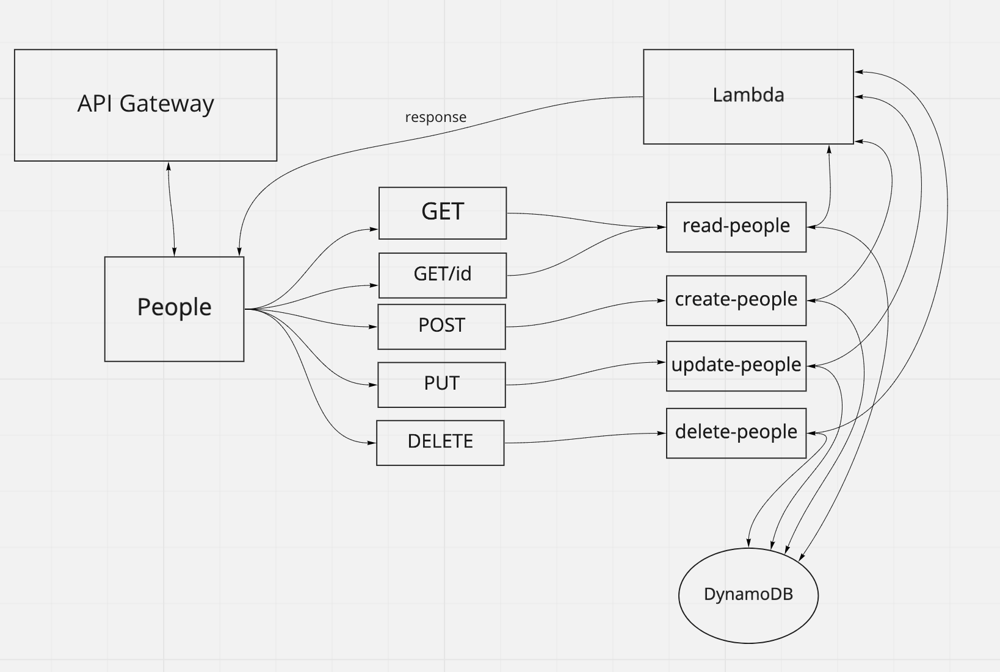

# serverless-api
Create a single resource REST API using a domain model of your choosing, constructed using AWS Cloud Services

## Root URL to API
https://jh9zkeie34.execute-api.us-west-2.amazonaws.com/test

## Routes
https://jh9zkeie34.execute-api.us-west-2.amazonaws.com/test/people
https://jh9zkeie34.execute-api.us-west-2.amazonaws.com/test/people/id

## Inputs Required
- Name
- Phone

## Outputs Returned
- ID

## UML
